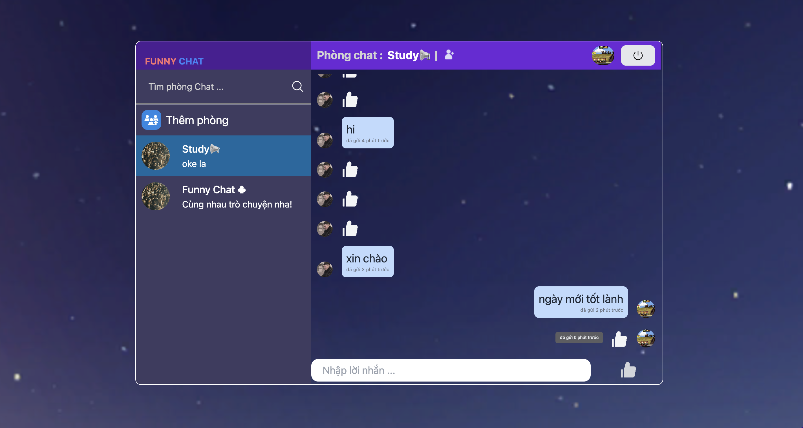

# Getting Started with Chat App

Install dependencies,you can run:

### `npm install`

In the project directory, you can run:

### `npm start`

Runs the app in the development mode.
Open [http://localhost:3000](http://localhost:3000) to view it in your browser.

 
    </img>
    </img>
    </img>
    </img>

  </a>

